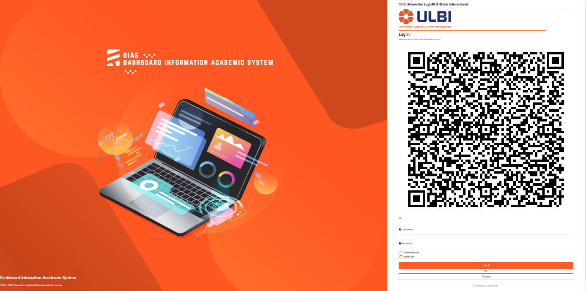
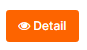

{width="8.39124343832021in"
height="11.868100393700788in"}

# **DAFTAR ISI** {#daftar-isi .TOC-Heading}

[DAFTAR GAMBAR [3](#daftar-gambar)](#daftar-gambar)

[A. Halaman Login [4](#halaman-login)](#halaman-login)

[1. Halaman Login [4](#halaman-login-1)](#halaman-login-1)

[B. Perwalian [5](#perwalian)](#perwalian)

[1. Perwalian Mahasiswa [5](#perwalian-mahasiswa)](#perwalian-mahasiswa)

[2. Konsultasi [5](#konsultasi)](#konsultasi)

[C. Approve [7](#approve)](#approve)

[1. Approve Perwalian [7](#approve-perwalian)](#approve-perwalian)

# DAFTAR GAMBAR {#daftar-gambar .list-paragraph}

[Gambar A.1 Halaman Login Dias [4](#_Toc90469189)](#_Toc90469189)

[Gambar B.1 Blok Menu Konsultasi [5](#_Toc90469190)](#_Toc90469190)

[Gambar B.2 Data Konsultasi [5](#_Toc90469191)](#_Toc90469191)

[Gambar B.3 Data Ticketing Mahasiswa [5](#_Toc90469192)](#_Toc90469192)

[Gambar B.4 Halaman Pembahasan [6](#_Toc90469193)](#_Toc90469193)

[Gambar C.1 Blok Approve Perwalian [7](#_Toc90469194)](#_Toc90469194)

[Gambar C.2 Halaman Approve Perwalian [7](#_Toc90469195)](#_Toc90469195)

# Halaman Login

## Halaman Login

Untuk masuk ke halaman **DIAS** Karo Akademik dapat mengakses ke halaman
utama [**https://dias.ulbi.ac.id/**](https://dias.ulbi.ac.id/)

  ---------------------------------------------------------------------------------------------
  {width="5.207784339457568in"
  height="2.594093394575678in"}
  ---------------------------------------------------------------------------------------------
  []{#_Toc90469189 .anchor}Gambar A.1 Halaman Login Dias

  ---------------------------------------------------------------------------------------------

Karo Akademik *login* terlebih dahulu dengan *username* dan *password*
yang telah ditentukan pada blok *login* yang berada disebelah kanan atas
pada halaman utama DIAS.

  ---------------------------------------------------------------------------------------------
  {width="2.153241469816273in"
  height="3.1271008311461066in"}
  ---------------------------------------------------------------------------------------------

  ---------------------------------------------------------------------------------------------

Setelah *login* berhasil, maka Karo Akademik akan diarahkan ke halaman
masing-masing untuk melaksanakan aktivitas pada DIAS.

# Perwalian

## Perwalian Mahasiswa

Pada blok **BK** klik menu **Konsultasi.**

  ---------------------------------------------------------------------------------------------
  {width="2.229478346456693in"
  height="0.7084317585301837in"}
  ---------------------------------------------------------------------------------------------
  []{#_Toc90469190 .anchor}Gambar B.1 Blok Menu Konsultasi

  ---------------------------------------------------------------------------------------------

## {width="0.71875in" height="0.4125in"}Konsultasi 

> Pada halaman Konsultasi klik *button* *detail* untuk melihat *detail*
> Konsultasi Mahasiswa.

  --------------------------------------------------------------------------------------------
  {width="5.78740157480315in"
  height="1.9062642169728783in"}
  --------------------------------------------------------------------------------------------
  []{#_Toc90469191 .anchor}Gambar B.2 Data Konsultasi

  --------------------------------------------------------------------------------------------

> {width="0.3418799212598425in"
> height="0.3333333333333333in"}Pada halaman *detail* Konsultasi
> Mahasiswa selanjutnya klik *No* *Ticket* kemudian klik *button*
> *Action*

  ---------------------------------------------------------------------------------------------
  {width="5.743628608923885in"
  height="3.3655643044619423in"}
  ---------------------------------------------------------------------------------------------
  []{#_Toc90469192 .anchor}Gambar B.3 Data *Ticketing* Mahasiswa

  ---------------------------------------------------------------------------------------------

> Apabila permasalahan mahasiswa dapat di selesaikan langsung oleh Karo
> Akademik maka pilih Status *Ticketing* *Done* kemudian isi keterangan
> tentang permasalahan ini, jika sudah selesai klik button *update*.

  ---------------------------------------------------------------------------------------------
  {width="4.604166666666667in"
  height="4.40625in"}
  ---------------------------------------------------------------------------------------------
  []{#_Toc90469193 .anchor}Gambar B.4 Halaman Pembahasan

  ---------------------------------------------------------------------------------------------

> Selanjutnya apabila permasalahan mahasiswa tidak bisa diatasi langsung
> oleh Karo Akademik maka Karo Akademik dapat meneruskan pesan mahasiswa
> dengan memilih Status *Ticketing* ke Unit yang bersangkutan mengenai
> permasalahan mahasiswa ini.

# Approve 

## Approve Perwalian

> Pada blok *Approve* klik *Approve* Perwalian

  -----------------------------------------------------------------------------------------------
  {width="2.1145833333333335in"
  height="0.9375in"}
  -----------------------------------------------------------------------------------------------
  []{#_Toc90469194 .anchor}Gambar C.1 Blok Approve Perwalian

  -----------------------------------------------------------------------------------------------

> {width="0.2916666666666667in"
> height="0.2722222222222222in"}Pada halaman *Approve* perwalian
> silahkan pilih dosen yang akan di *Approve* selanjutnya pada halaman
> *detail* laporan perwalian Karo Akademik dapat mengecek **Berkas
> perwalian, Lampiran Perwalian** dengan men-klik *button* seperti ini

  ----------------------------------------------------------------------------------------------
  {width="5.603862642169728in"
  height="2.3468416447944005in"}
  ----------------------------------------------------------------------------------------------
  []{#_Toc90469195 .anchor}Gambar C.2 Halaman Approve Perwalian

  ----------------------------------------------------------------------------------------------

> Apabila **Berkas perwalian, Lampiran Perwalian** sudah lengkap dan
> sesuai silahkan klik *button* *Approve* Laporan jika tidak lengkap,
> sesuai silahkan klik Tolak Laporan.
